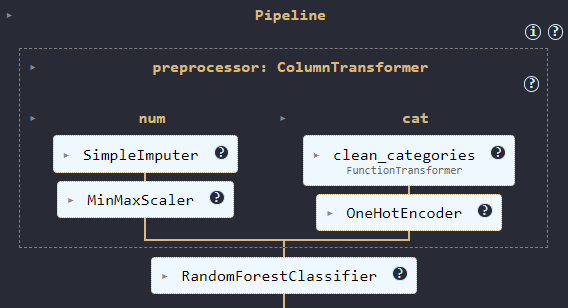
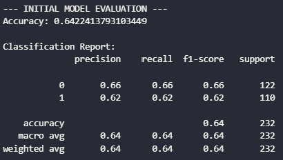
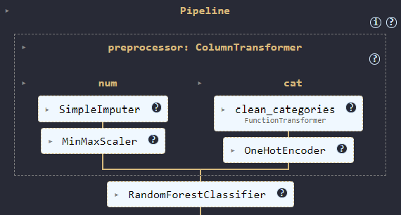
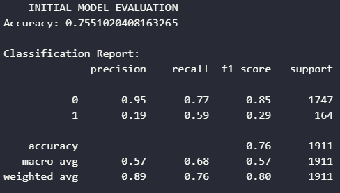
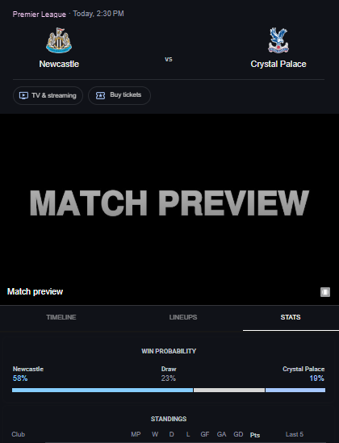
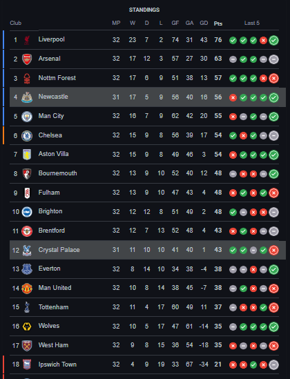
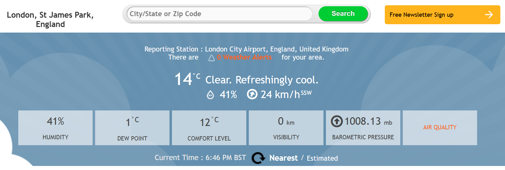
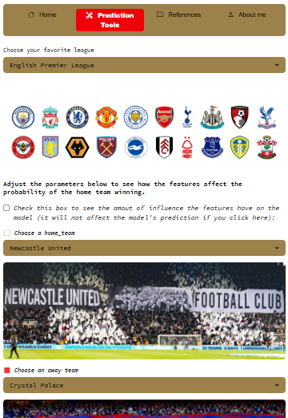
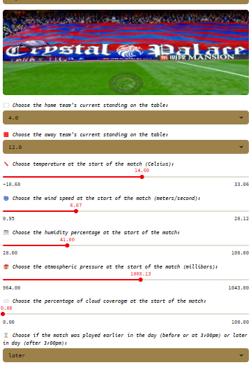
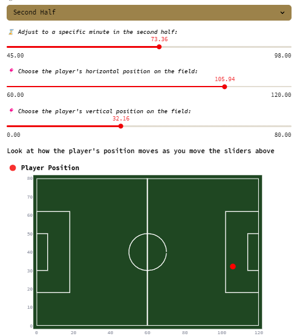

# **CAPSTONE PROJECT** (Galvanize DDI Cohort 11) - _**Analyzing soccer goals and match outcomes**_ 
_by Victor Chang_

## Table of Contents

- [Project Overview](#project-overview)
- [Research Question](#research-question)
- [Description of Data](#description-of-data)
  - [SportMonks](#sportmonks)
  - [Statsbomb](#statsbomb)
- [Cleaning and Transforming Data](#cleaning-and-transforming-data)
  - [SportMonks](#sportmonks-1)
  - [Statsbombpy](#statsbombpy)
- [Training and Testing the Model](#training-and-testing-the-model)
  - [SportMonks](#sportmonks-2)
  - [Statsbombpy](#statsbombpy-1)
- [Model Comparisons](#model-comparisons)
  - [Home Team Winning Predictions](#english-premier-league-home-team-winning-predictions)
  - [Goal Scoring Predictions](#english-premier-league-goal-scoring-predictions)
- [Final Thoughts](#final-thoughts)
- [Future Recommendations/Areas of Study](#future-recommendationareas-of-study)

# **Project Overview**
The goal of this project was to work with different soccer datasets and create predictive models that assimilate real life outcomes in soccer. The models are used to feed a streamlit app that allows users to control parameters that define the outcome probabilities. The app displays two different predictions: probability of the home team winning a certain match, and the probability of goal scoring at a certain time and position of the game. Both models are produced with data from the English Premier League, with a bonus goal's predictive model of Messi from his years at FC Barcelona. 

# **Research Question**
This project aims to answer two main questions about the English Premier League.
1. The effects of home advantage, current standing, and weather have on a match's outcome.
2. The effects that playing role, type of play, minute of the game, team, and field position have on the probability of scoring.


# **Description of Data**
## SportMonks
SportMonks API offers a free 14 day trial on their service which gives you access to a multitude of data. We utilized the data to dig deep into the English Premier League matches since the Statsbombpy open data was limited. Analyzing match outcomes required more data about fixtures played, such as: venue, team standings, and weather data (temperature, winds, humidity, pressure, and cloud coverage). We gathered the data for 5 seasons, from 2020/2021 to 2024/2025. The data was compiled into a single file to be analyzed. 
### The columns include: 
The dataset gathered had multiple lines of data, but the actual model was only fed the following columns:

| **Name**           | **Non-Null Values** | **Type**   | **Description**                                               |
|--------------------|---------------------|------------|---------------------------------------------------------------|
| `position_away`    | 1160 non-null       | float64    | The current standing of the away team                         |
| `position_home`    | 1160 non-null       | float64    | The current standing of the home team                         |
| `winner_home`      | 1160 non-null       | int32      | If the home team won that match                               |
| `match_temperature`| 1160 non-null       | float64    | The temperature recorded that match                         |
| `wind_speed`       | 1160 non-null       | float64    | The speed of winds                                            |
| `humidity`         | 1160 non-null       | float64    | Percentage of humidity                                        |
| `pressure`         | 1160 non-null       | float64    | The amount of atmospheric pressure                            |
| `clouds`           | 1160 non-null       | float64    | Percentage of cloud coverage                                  |
| `team_name_home`   | 1160 non-null       | object     | The name of the home team                                     |
| `team_name_away`   | 1160 non-null       | object     | The name of the away team               |
| `time_of_day`      | 1160 non-null       | object     | Earlier or later games (before or after 3:00pm)              |


## Statsbomb
Statsbomb offers open datasets that are structured the same way as the datasets that you get with a paid subscription. This allows for training without having a paid subscription. Statsbomb offers thorough information that integrates well with python, however the free datasets available are limited and some outdated. The dataset from Statsbomb used in this project is the English Premier League events dataset for the 2015/2016 season, which lasts from August 8th, 2015 to May 17, 2016. The events dataset provided play by play information of every match that was played that year.  
### The columns include: 
The dataset gathered had multiple lines of data, but the actual model was only fed the following columns:
| **Name**           | **Non-Null Values** | **Type**   | **Description**                                        |
|--------------------|---------------------|------------|--------------------------------------------------------|
| `position`         | 9554 non-null       | object     | The player's role                                      |
| `possession_team`  | 9554 non-null       | object     | The team who has possession                            |
| `play_pattern`     | 9554 non-null       | object     | The way the goal is scored                             |
| `shot_outcome`     | 9554 non-null       | int32      | Goal or no goal                                        |
| `under_pressure`   | 9554 non-null       | bool       | If the player is under pressure during the chance      |
| `x`                | 9554 non-null       | float64    | The player's position across the x-axis                |
| `y`                | 9554 non-null       | float64    | The player's position across the y-axis                |
| `minute_in_half`   | 9554 non-null       | int64      | The exact minute of the match                          |
| `match_period`     | 9554 non-null       | int64      | Whether it is the 1st or 2nd half of the match         |


# **Cleaning and Transforming Data**
## SportMonks
1. The dataset was gathered from the sportmonks api for the English Premier League.
2. Fixture, weather, and venue data were gathered for each season from 2020 to 2025 (5 seasons)
3. The data for all five seasons were combined into one expanded dataframe and saved as a CSV file.
4. Percent signs were removed from humidity and clouds.
5. Temperature values were matches to specific match time.
6. A few extreme (273C) temperature values were removed.
7. Missing or Null values for temperature, wind speeds, and pressure were filled with mean values. 
8. The starting at column was divided into year, month, day, and time.
9. Time of day column was created to divide games that were before or after 2:30pm. 
10. Null values for position at home and winner at home were dropped. 
11. Winner at home data type was changed to integer. 

## Statsbombpy
1. The dataset gathered was from the statsbombby open data for the English Premier League 2015/2016 season.
2. All events were outputted for every single match_id foud in that season. 
3. The data was saved to a CSV file for easier use.
4. The type column was transformed to only include shot opportunities and goals were turned to 1, everything else to 0.
5. Under pressure values were changed to True and False only.
6. X and Y features were created instead of the location column.
7. The optinos in the position feature was changed to be into 3 general positions (defense, midfield, forward).
8. Only relevant play patterns were kept with useful numbers.
9. Match period and minute features were created to more accurately represent the time of the match.


# **Training and Testing the Model**
## SportMonks
### English Premier League Match Outcome: 
#### Dividing the dataset into X and y:
- **Features (`X` and `y`)**:
    ```python
    X = team_shortened[['position_away', 'position_home', 'match_temperature', 'wind_speed', 'humidity', 'pressure', 'clouds', 'team_name_home','team_name_away', 'time_of_day']]
    y = team_shortened['winner_home']

    X_train, X_test, y_train, y_test = train_test_split(
        X, y, test_size=0.2
    )
    X_test.shape

    ```
#### Constructing a pipeline for ease of cleaning and transformation:
- **Pipeline**:
    ```python
    # First, let's pick out which columns are numeric vs. categorical
    numeric_features = ['match_temperature', 'wind_speed', 'humidity', 'pressure', 'clouds']

    categorical_features = ['team_name_home', 'team_name_away', 'position_away', 'position_home', 'time_of_day']

    numeric_transformer = Pipeline([
        ("imputer", SimpleImputer(strategy="mean")),   # Fill missing with mean
        ("scaler", MinMaxScaler())                     # Scale to [0, 1]
    ])

    categorical_cleaner = Pipeline([
        ("cleaner", FunctionTransformer(clean_categories)),
        ("encoder", OneHotEncoder(handle_unknown="ignore"))
    ])


    # ColumnTransformer applies the correct transformer to each column set
    preprocessor = ColumnTransformer([
        ("num", numeric_transformer, numeric_features),
        ("cat", categorical_cleaner, categorical_features)
    ])
    ```        
#### Executing the pipeline with different models. Ultimately the best model found was Random Forest Classification (shown below):
- **Random Forest Classifier**:
    ```python
    model_rf = Pipeline([
    ("preprocessor", preprocessor),
    ("classifier", RandomForestClassifier(n_estimators = 300, max_depth = 10, min_samples_leaf = 2, class_weight='balanced', random_state=42))
    ])

    model_rf.fit(X_train, y_train)
    ```
    

#### Evaluating the model for accuracy, precision, and recall:
- **Random Forest Classifier Model Evaluation**:
    ```python
    y_pred_rf = model_rf.predict(X_test)
    accuracy = accuracy_score(y_test, y_pred_rf)
    print("\n--- INITIAL MODEL EVALUATION ---")
    print("Accuracy:", accuracy)
    print("\nClassification Report:")
    print(classification_report(y_test, y_pred_rf))
    ```
    
    
#### Perform cross-validation to split the train, testing samples and rerun the model:
- **Random Forest Classifier Cross Validation**:
    ```python
    # Define K-Fold
    kfold = KFold(n_splits=4, shuffle=True, random_state=7)

    # Perform cross validation
    scores = cross_val_score(model_rf, X, y, cv=kfold, scoring='neg_mean_squared_error')

    # Convert scores to positive by multiplying by -1
    mse_scores = -scores
    print("MSE scores for each fold:", mse_scores)
    print("Average MSE:", np.mean(mse_scores))
    ```
    #### MSE scores for each fold: [0.36896552 0.34827586 0.41034483 0.36896552]
    #### Average MSE: 0.37413793103448273


## Statsbombpy
### English Premier League Goal Scoring: 
#### Dividing the dataset into X and y:
- **Features (`X` and `y`)**:
    ```python
    X = team_shots_df[['match_period', 'minute_in_half', 'possession_team', 
                     'play_pattern', 'position', 'x', 'y']]
    y = team_shortened['winner_home']

    X_train, X_test, y_train, y_test = train_test_split(
        X, y, test_size=0.2
    )
    ```
#### Constructing a pipeline for ease of cleaning and transformation:
- **Pipeline**:
    ```python
    # First, let's pick out which columns are numeric vs. categorical
    numeric_features = ['match_period', 'minute_in_half', 'x', 'y']

    categorical_features = ['position', 'possession_team', 'play_pattern']

    numeric_transformer = Pipeline([
        ("imputer", SimpleImputer(strategy="mean")),   # Fill missing with mean
        ("scaler", MinMaxScaler())                     # Scale to [0, 1]
    ])

    categorical_cleaner = Pipeline([
        ("cleaner", FunctionTransformer(clean_categories)),
        ("encoder", OneHotEncoder(handle_unknown="ignore"))
    ])


    # ColumnTransformer applies the correct transformer to each column set
    preprocessor = ColumnTransformer([
        ("num", numeric_transformer, numeric_features),
        ("cat", categorical_cleaner, categorical_features)
    ]) 
    ```        
#### Executing the pipeline with different models. Ultimately the best model found was Random Forest Classification (shown below):
- **Random Forest Classifier**:
    ```python
    model_rf = Pipeline([
        ("preprocessor", preprocessor),
        ("classifier", RandomForestClassifier(n_estimators = 300, max_depth = 10, min_samples_leaf = 2, class_weight='balanced', random_state=42))
    ])

    model_rf.fit(X_train, y_train)
    ```
    

#### Evaluating the model for accuracy, precision, and recall:
- **Random Forest Classifier Model Evaluation**:
    ```python
    y_pred_rf = model_rf.predict(X_test)
    accuracy = accuracy_score(y_test, y_pred_rf)
    print("\n--- INITIAL MODEL EVALUATION ---")
    print("Accuracy:", accuracy)
    print("\nClassification Report:")
    print(classification_report(y_test, y_pred_rf))
    ```
    
    
#### Perform cross-validation to split the train, testing samples and rerun the model:
- **Random Forest Classifier Cross Validation**:
    ```python
    # Define K-Fold
    kfold = KFold(n_splits=4, shuffle=True, random_state=7)

    # Perform cross validation
    scores = cross_val_score(model_gbc, X, y, cv=kfold, scoring='neg_mean_squared_error')

    # Convert scores to positive by multiplying by -1
    mse_scores = -scores
    print("MSE scores for each fold:", mse_scores)
    print("Average MSE:", np.mean(mse_scores))
    ```
    #### MSE scores for each fold: [0.09669318 0.08706572 0.09589615 0.09296482]
    #### Average MSE: 0.09315496661485186

# **Model Comparisons**
## English Premier League Home Team Winning Predictions:
 

#### Current Weather Updates at 1:30pm
* Home Stadium: St. James' Park, Newcastle's home stadium
* Temperature: 14C
* Wind Speeds: 24km/hr --> 6.67m/s
* Humidty: 41%
* Pressure: 1008.13mb
* Cloud Coverage: Seems clear ~ 0%
### The two images above were captured around 1:30pm (EST) on April 16th, 1 hour before the start of the match. Newcastle United is hosting Crystal Palace at their home stadium. Newcastle United is ranked 4th in the table, while Crystal Palace is ranked 12th. The probability online shows in favor of Newcastle United winning at 58%. The app below with defined parameters as close as possible show us the probability of Newcastle winning at 55.72%. 

 

## English Premier League Goal Scoring Predictions:


### This goal was scored by Arsenal's Declan Rice on March 9th against Manchester United during a regular premier league season match. The goal was scored between the 73rd and 74th minute, by Declan Rice (midfielder) during a regular play. Adjusting the parameters below to match this play as close as possible, we see that the probability of scoring was about 53.67% for this shot. 

 

# **Final Thoughts**
Both tools in the application show great promise in predictions. Predicting the outcome of a match should inherently be easier than predicting the exact moment someone is going to score in a match. So, it might be best to look at the scoring prediction tool as more of a guide in how one should shoot to score more goals. The outcome predictor tool will need testing to confirm its reliability and will most definitely need refinement as the league continues to go on. 


# **Future Recommendation/Areas of Study**
* Gather more data for events from Statsbombpy open data or other API/datasets, especially more recent years, which may require access to Statsbomb full API or utilizing other APIs. 
* Gather data for other leagues (La liga data from Statsbombpy was not used because most of the data was sources for FC Barcelona and not other teams).
* Gather more seasons for matches from the SportMonks API and continue to refine the model.
* Study the model's predictions to figure out its success in future matches. 
* Find additional features that will be relevant to add to the prediction tool. 

